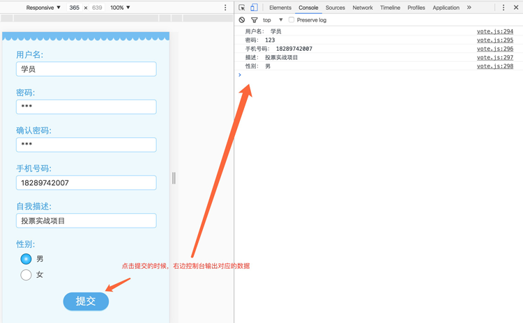
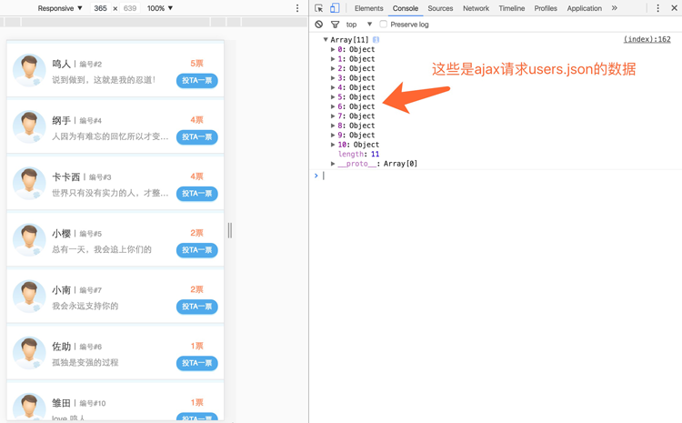

## 项目简介
1. 将本目录下的设计稿psd图文件夹里的psd文件切成静态页面，并将所有静态页面放入到template文件夹里（只有这个步骤完成后才能进行下一个步骤的内容）。
2. 使用zepto.js（类似jquery.js）类库，实现报名页里点击提交时，在控制台依次输出用户名、密码、电话号码、描述、性别。其中得判断用户名、密码、电话号码、描述是否是合法数据，如果不合法则需要弹出对应的提示，举例如下: 
        
这四个字段的合法条件
	- 用户名：不能为空
	- 密码：只能是字母或者数字且不能超过10个字符
	- 电话号码： 只能是11位的数字
	- 描述：不能为空且不能超过20个字符
3. 通过zepto.js的ajax请求方法获取template文件夹里的users.json数据，并通过字符串拼接方法输出到首页上。注意：需要在webstorm打开页面，这样才能使用ajax方法访问到users.json数据，否则ajax会报错！举例如下：

4. 通过zepto.js（或者用原生js）的事件委托方法绑定3中的投TA一票点击事件，使点击每个按钮，都弹出“hello world”。
5. 点击首页的搜索按钮的时候，页面跳到搜索页，且在控制台输出在首页输入搜索框的内容。

## 一句话
泰戈尔说，不要着急，最好的总会在最不经意的时候出现。那我们要做的就是：怀揣希望去努力，静待美好的出现。
